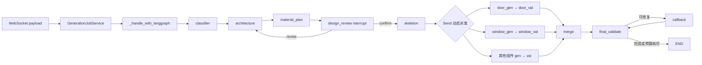

# 10 · 用 WildAgent 学懂 LangGraph 工作流与中间状态

## 这次重新定位什么

这个模块不再按 `State`、Reducer、`Send`、`interrupt` 分别讲概念。它围绕 WildAgent 的一次真实建筑生成，回答四个连在一起的问题：

1. 请求怎样进入 LangGraph，下一节点由谁决定；
2. 一个节点收到的是哪一版完整 State，又只返回哪些局部更新；
3. 旧方案中的普通 `dict` 为什么“传进去了，却没有形成约束”；
4. 新增的 `DesignDocument → ResolvedDesign → 人工审核 → Blueprint` 怎样把设计意图变成可维护的中间产物。

## 先给结论

这次 WildAgent 改造已经解决了难点的核心部分，但还没有完成整个 State 的类型化迁移。

已经解决的部分：

- 建筑设计从临时 `architecture_plan: dict` 提升为有 schema、revision、status 和规则来源的 `DesignDocument`；
- 同一份文档确定性解析为 `ResolvedDesign`，SVG 和后续 Blueprint 共用这份设计；
- `design_review` 在骨架生成前暂停，用户批准的是具体设计 revision；
- 恢复后从批准文档重新编译 `architecture_plan`，再进入旧的生成节点；
- Blueprint 写入 `designSchemaVersion`、`designRevision` 和 `designHash`，可以追溯到批准版本。

仍需继续收口的部分：

- `GenerationState` 仍是 `TypedDict(total=False)`，大量字段在运行时仍是普通 `dict`；
- `architecture_plan`、`design_brief` 是兼容旧节点的中间协议，字段消费还没有全部转向 `ResolvedDesign`；
- `merge_state_mapping` 只做顶层浅合并；同名 key 仍会以后写覆盖前写；
- 当前证据包含源码与回归测试；本次在 studyAgent 实测导入 LangGraph 仍被 `WinError 10106` 的主机网络栈故障阻断。

因此，本模块不会得出“以后不用 dict”的结论。正确边界是：

```text
LangGraph State：传递一次工作流的可序列化快照
DesignDocument：维护用户可审核、可修改、可版本化的设计事实
ResolvedDesign：从设计事实确定性推导出的坐标、槽位和数量
Blueprint：编译和校验后的最终产物
```

## 真实主链

普通生成模式：



`plan_mode` 会在业务节点外增加 `planning_research → planner → plan_validator → plan_review → plan_executor` 调度层。它解决“先批准执行步骤”；`design_review` 解决“再批准具体建筑设计”，两次审核的对象不同。

## 章节目录

| 章节 | 沿真实问题学习 | Notebook 最终观察 |
| --- | --- | --- |
| [00 公共环境初始化](docs/00-Notebook公共环境初始化.md) | 明确只读源码根目录与本次版本 | 所有真实源码锚点均存在 |
| [01 新旧方案与问题边界](docs/01-新旧方案与问题边界.md) | 这次到底解决了什么 | 画出四层数据职责图 |
| [02 一次生成的真实节点调用链](docs/02-一次生成的真实节点调用链.md) | 谁调用 Graph、边怎样选节点 | 从源码提取节点与路由证据 |
| [03 State 到底怎样传播](docs/03-State到底怎样传播.md) | 输入、节点局部输出、完整 State、事件 | 在微型图中看到三种对象的不同形状 |
| [04 旧 dict 为什么利用率低](docs/04-旧dict为什么利用率低.md) | `dict`、`TypedDict` 和 Prompt 约束的边界 | 重现缺字段、拼错 key 和浅合并问题 |
| [05 DesignDocument 怎样成为设计事实](docs/05-DesignDocument怎样成为设计事实.md) | schema、revision、patch、resolve、hash | 验证无效设计在边界被拒绝 |
| [06 方案材质审核的状态时序](docs/06-方案材质审核的状态时序.md) | 三个节点怎样共同维护一版设计 | 写出 confirm/revise 的字段变化表 |
| [07 interrupt到恢复的完整链路](docs/07-interrupt到恢复的完整链路.md) | Checkpoint、Job、Command 如何协作 | 区分暂停点、任务状态和恢复载荷 |
| [08 从批准设计到最终Blueprint](docs/08-从批准设计到最终Blueprint.md) | 下游怎样消费，哪里仍有兼容 dict | 追踪 hash 与配额直到最终产物 |
| [09 事件观测与完成验收](docs/09-事件观测与完成验收.md) | 怎样证明状态真的被使用 | 完成一次源码证据审计 |

## 进阶专题

完成第00～09章后，进入[专题01：用契约测试推进 LangGraph 中间状态迁移](topics/01-typed-state-contract-migration/README.md)。专题提供一套完全位于 studyAgent 的缩小实现和13项单元测试，继续学习 `GenerationSpec`、节点运行时边界、revision、稳定 hash 与逐节点迁移；不会修改 WildAgent。

## Notebook 使用约定

- 你继续维护现有的 `01.basic.ipynb`，本次不修改它；
- 每次重启 Kernel，先运行第00章；
- 真实 WildAgent 只读源码，不从 Notebook 启动其模型、数据库或 WebSocket 服务；
- LangGraph 行为用 studyAgent 环境中的微型图观察；
- 每个 Cell 都要记录“输入、局部输出、完整 State、事件”中的哪一种。

## 三天学习节奏

| 天数 | 内容 | 产出 |
| --- | --- | --- |
| Day 11 | 第00～03章 | 一张真实调用链图和一张 State 字段传播表 |
| Day 12 | 第04～06章 | 旧 dict 失效案例与新设计契约对照表 |
| Day 13 | 第07～09章 | 暂停恢复时序图、Blueprint 追溯证据和剩余债务清单 |

## 模块完成标准

- [ ] 我能从 WebSocket payload 追到某个真实节点，而不是只会画 `START → node → END`
- [ ] 我能区分节点局部返回、合并后的完整 State 与 `astream_events` 事件
- [ ] 我能解释 `TypedDict(total=False)` 为什么不等于运行时校验
- [ ] 我能说明旧方案的问题是“设计事实没有独立契约”，而不只是“dict 不好”
- [ ] 我能画出 `DesignDocument → ResolvedDesign → SVG/Blueprint` 的单一来源关系
- [ ] 我能解释 confirm 与 revise 恢复后分别走哪条边
- [ ] 我能指出当前仍依赖 `architecture_plan`、`design_brief` 的位置
- [ ] 我能用源码或测试证据说明某个字段是否真的被消费
- [ ] 我能完成专题01的契约测试，并为下一项状态迁移先写行为测试

## 本次文档验收

- 17 份 Markdown（主模块11份 + 进阶专题6份）；
- 52 个 Python 代码块已通过 AST 语法检查；
- 72 个模块、专题和 WildAgent 只读源码链接均有效；
- 专题13项单元测试中12项通过；
- 真实 LangGraph 适配测试在导入阶段被本机 `WinError 10106` 阻断并明确跳过，没有写成运行通过。
