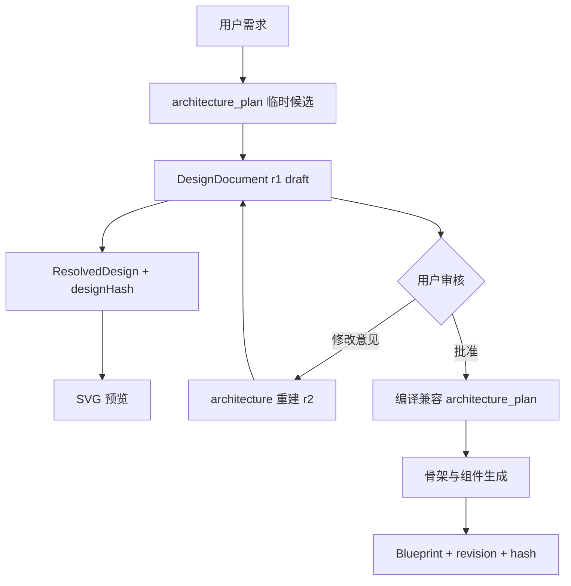

# 第01章：新旧方案与问题边界

## 本章目标

先判断这次改造解决了什么，再进入 LangGraph 细节。你需要建立一个关键认识：工作流 State、设计事实和最终 Blueprint 是三种生命周期不同的数据。

源码锚点：[graph_state.py](../../../WildAgent/wild-server/app/agent/graph_state.py)、[contracts.py](../../../WildAgent/wild-server/app/design/contracts.py)、[resolver.py](../../../WildAgent/wild-server/app/design/resolver.py)。

## 1. 旧链路的核心问题

旧链路大致是：

```text
用户自然语言
→ architecture 节点产出 architecture_plan: dict
→ material_plan: dict
→ skeleton 通过 Prompt 或辅助函数读取部分 plan
→ 生成 design_brief: dict
→ 组件节点分别读取部分字段
→ merge / validator 才发现门窗数量或位置没有兑现
```

这里并非完全没有方案，也并非所有字段都没用。问题在于 `architecture_plan` 同时承担了模型输出、节点消息、设计方案和下游参数四种职责。它没有独立的版本、批准状态和稳定 schema，下游还可以只读取方便读取的几个字段。

例如，`GenerationState` 声明 `architecture_plan: dict`，只能说明“这里大概有个字典”。它不能表达：

- `massing.width` 必须大于 0；
- `facades.front.ground_pattern` 长度必须等于 `bays`；
- 多层建筑必须有竖向交通策略；
- 用户批准的是 revision 1 还是 revision 2；
- SVG 与 Blueprint 是否来自同一版设计。

## 2. 新链路增加的四层职责

| 层 | 当前对象 | 生命周期 | 谁负责 |
| --- | --- | --- | --- |
| 工作流运输层 | `GenerationState` | 一次 Graph 运行及 checkpoint | LangGraph |
| 设计事实层 | `DesignDocument` | 跨暂停、修改、批准、编译 | Pydantic + `DesignRepository` |
| 确定性派生层 | `ResolvedDesign` | 随某一设计 revision 重新计算 | `resolve_design()` |
| 几何产物层 | Blueprint | 生成、合并、校验、交付 | skeleton/components/merge/validate |

新链路是：



`architecture_plan` 仍存在，因为现有 skeleton、组件派发和布局函数仍消费它。它现在更接近“兼容编译结果”，不再是用户批准的唯一事实来源。

## 3. 判断“是否解决”的四个标准

| 标准 | 当前结果 | 证据 |
| --- | --- | --- |
| 中间设计能否运行时校验 | 已解决核心 | `ContractModel(extra="forbid", validate_assignment=True)` |
| 用户能否审核具体设计 | 已解决核心 | `design_review` + SVG + `interrupt()` |
| 修改是否有 revision 和冲突检查 | 已解决核心 | `DesignPatch.base_revision` + repository |
| 所有下游是否只消费类型化设计 | 尚未完成 | `architecture_plan`、`design_brief` 仍为 dict |

“解决核心”表示新系统已经有正确的主干；“尚未完成”表示兼容层还需要逐节点迁移，不能把这次改造描述成整个 Agent State 已经完美。

## Notebook 分单元格练习

### Cell 1：从源码找四层对象

- 输入：第00章的 `sources`；
- 前序依赖：第00章 Cell 4；
- 预期：四项断言通过；
- 观察：不同对象分布在不同文件，而不是塞进一个 State 类。

```python
evidence = {
    "workflow_state": "class GenerationState" in sources["state"],
    "design_contract": "class DesignDocument" in sources["contracts"],
    "resolved_design": "class ResolvedDesign" in sources["contracts"],
    "final_blueprint": "final_blueprint" in sources["state"],
}

# all() 序列全部为 True 才返回 True；只要有 1 个 False，直接返回 False
assert all(evidence.values()), evidence
evidence
```

### Cell 2：确认设计文档有版本状态

- 输入：`sources["contracts"]`；
- 前序依赖：Cell 1；
- 预期：找到 `schema_version`、`revision`、`status`；
- 观察：这些字段描述的是设计文档生命周期，不是 Graph 当前运行到哪个节点。

```python
for token in ("schema_version", "revision", "status", "approved_at"):
    print(token, "→", token in sources["contracts"])
```

### Cell 3：建立自己的职责表

在 Notebook 中创建四行字典，每行填写 `object`、`owner`、`mutable_by`、`expires_when`。结合源码写出自己的理解。

## 错误实验

把 `workflow_state` 和 `DesignDocument.status` 当成一回事，然后检查源码：后者只允许 `draft | approved | compiled`。同名的“状态”概念如果不标所属对象，很容易把流程进度与设计批准状态混在一起。

## 完成检查

- [ ] 我能说明旧方案不是“完全没用 architecture_plan”
- [ ] 我能说明为什么设计事实不能只存在于 Graph 临时 State
- [ ] 我能说出四层对象的所有者和生命周期
- [ ] 我知道当前 `architecture_plan` 是仍需迁移的兼容协议
