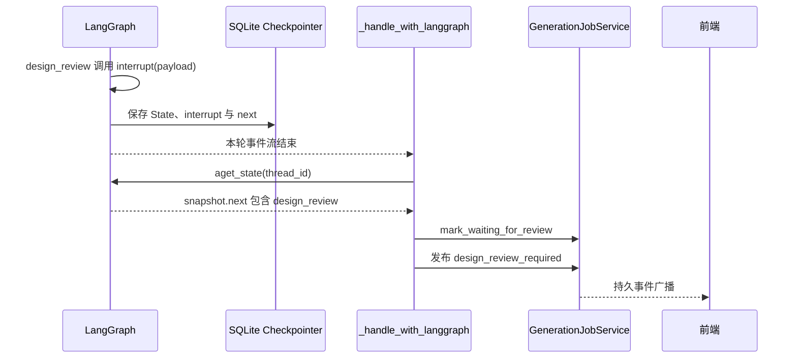

# 第07章：从 interrupt 到恢复的完整链路

## 本章目标

把 LangGraph checkpoint、Generation Job、DesignRepository 和持久事件放进同一张时序图，理解为什么只会写 `interrupt()` 还不够。

源码锚点：[design_review_node.py](../../../WildAgent/wild-server/app/agent/nodes/design_review_node.py)、[ws_agent.py](../../../WildAgent/wild-server/app/api/ws_agent.py)、[generation_job_service.py](../../../WildAgent/wild-server/app/services/generation_job_service.py)。

## 1. 暂停链路



`GenerationPaused` 是服务层对“本轮任务正常暂停”的表达。Job Service 捕获它后保留 `waiting_review`，不能把它当异常失败。

## 2. 恢复链路

```text
前端提交 design_review_response
→ generation_job_service.submit_design_review(...)
→ 检查 job、session、waiting_review_type、base_revision
→ 从 DesignRepository 读取最新文档
→ payload["_design_review"] = {action, feedback, document}
→ job 状态改回 running
→ _spawn(job, resume=True)
→ _handle_with_langgraph(..., resume=True)
→ graph.aget_state(same thread_id)
→ Command(resume=payload["_design_review"])
→ design_review 从头执行
→ interrupt() 返回审核决定
→ 节点 return 局部更新
→ route_design_review 选择下一节点
```

必须复用完全相同的：

```python
{"configurable": {"thread_id": f"generation:{request_id}"}}
```

换了 `thread_id` 就找不到原暂停点。

## 3. 四种持久对象保存什么

| 对象 | 保存内容 | 用于回答 |
| --- | --- | --- |
| LangGraph Checkpoint | State channels、next、interrupt、运行进度 | Graph 从哪里继续 |
| Generation Job | request/session、原 payload、running/waiting/completed | 后台任务是否需要恢复 |
| DesignRepository | DesignDocument 当前版与 history | 用户批准和修改的是哪版设计 |
| Durable Event | 带序号的前端协议事件 | WebSocket 断线后补发什么 |

它们不能互相替代。例如 Job 记着 `waiting_review`，却不包含 LangGraph channel 的完整合并语义；Checkpoint 有设计 dict，却不负责 revision 历史与可编辑锁。

## 4. interrupt 节点的副作用规则

恢复时节点从头执行，所以 `interrupt()` 之前的代码可能重复。当前 `design_review` 在暂停前只做 Pydantic 校验、`resolve_design()` 和 payload 构造，都是可重复计算；真正的 `repository.approve()` 放在 interrupt 返回之后。

这是检查任何审核节点时都要问的问题：

```text
interrupt 前是否写数据库、扣费、发邮件、创建不可重复资源？
```

若有，需要把副作用移到恢复之后，或设计幂等键。

## Notebook 分单元格练习

### Cell 1：构造最小审核图

- 输入：无；
- 前序依赖：已完成第03章；
- 预期：图带内存 checkpointer；
- 观察：checkpoint 需要 thread_id。

```python
from typing import TypedDict
from langgraph.checkpoint.memory import InMemorySaver
from langgraph.graph import END, StateGraph
from langgraph.types import Command, interrupt

class ReviewState(TypedDict, total=False):
    design: dict
    review_status: str

def prepare(state: ReviewState) -> dict:
    return {"design": {"revision": 1, "width": 20}}

def review(state: ReviewState) -> dict:
    decision = interrupt({"type": "design_review", "document": state["design"]})
    return {"review_status": decision["action"]}

builder = StateGraph(ReviewState)
builder.add_node("prepare", prepare)
builder.add_node("review", review)
builder.set_entry_point("prepare")
builder.add_edge("prepare", "review")
builder.add_edge("review", END)
review_graph = builder.compile(checkpointer=InMemorySaver())
```

### Cell 2：第一次运行并检查 snapshot

- 输入：固定 `thread_id`；
- 前序依赖：Cell 1；
- 预期：`snapshot.next` 包含 `review`；
- 观察：`snapshot.values` 是完整 State。

```python
review_config = {"configurable": {"thread_id": "design-demo-1"}}
first_result = review_graph.invoke({}, config=review_config)
snapshot = review_graph.get_state(review_config)

print("invoke result:", first_result)
print("snapshot values:", snapshot.values)
print("snapshot next:", snapshot.next)
```

### Cell 3：使用 Command 恢复

- 输入：同一 `review_config`；
- 前序依赖：Cell 2；
- 预期：`review_status="confirm"` 且 `snapshot.next` 为空；
- 观察：不要再次传初始 State。

```python
resumed = review_graph.invoke(
    Command(resume={"action": "confirm"}),
    config=review_config,
)
print(resumed)
print("next:", review_graph.get_state(review_config).next)
```

### Cell 4：读取真实恢复证据

- 输入：`sources["ws"]` 与 `sources["jobs"]`；
- 前序依赖：第00章；
- 预期：四项均为 True；
- 观察：Graph 恢复与任务恢复跨越两个模块。

```python
evidence = {
    "snapshot": "aget_state(graph_config)" in sources["ws"],
    "command": "Command(resume=" in sources["ws"],
    "waiting_review": "waiting_review" in sources["jobs"],
    "design_payload": "_design_review" in sources["jobs"],
}
evidence
```

## 错误实验

在 Cell 3 中把 thread_id 改成 `design-demo-2`。记录异常或空状态，再恢复原 thread_id。这个实验说明“恢复载荷相同”不足以恢复，checkpoint 地址也必须相同。

## 完成检查

- [ ] 我能画出暂停与恢复两段时序
- [ ] 我能区分四种持久对象
- [ ] 我能解释节点恢复时为什么会从头执行
- [ ] 我能说明 interrupt 前的副作用为什么必须可重复
