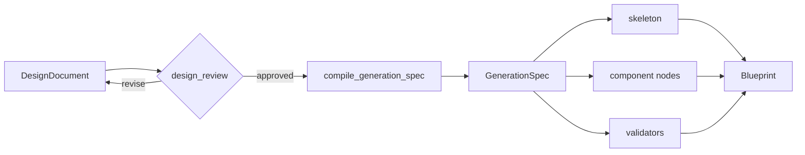

# 专题01：用契约测试推进 LangGraph 中间状态迁移

## 为什么10模块之后还需要这个专题

10模块学完后，你可以定位节点调用、State 传播和旧 dict 失效的位置，也能判断当前 DesignDocument 改造解决了哪些边界。要独立解决下一阶段问题，还需要把这些判断变成可执行设计：

```text
怎样定义节点之间唯一的编译协议
→ 怎样在节点入口和出口校验
→ 怎样证明节点只写自己拥有的字段
→ 怎样阻止未批准或旧 revision 进入生成
→ 怎样逐节点替换旧 dict，而不一次破坏现有链路
```

这个专题用一个缩小版建筑流水线回答这些问题。所有代码都在 studyAgent，WildAgent 仅用于只读对照。

## 推荐的下一阶段主线



`GenerationSpec` 是本专题提出的下一层协议：它只从已批准的 DesignDocument 确定性编译，集中保存标高、体量边界、立面槽位、组件数量和 design hash。它用于逐步取代当前 `architecture_plan + design_brief` 的重复职责。

这是一项后续设计方案，不代表 WildAgent 已经实现了 `GenerationSpec`。

## 专题文件

| 文件 | 用途 |
| --- | --- |
| [contract_pipeline.py](contract_pipeline.py) | 缩小版契约、State update、revision 和编译器 |
| [test_contract_pipeline.py](tests/test_contract_pipeline.py) | 13 项行为测试 |
| [第00章](docs/00-测试环境与阅读顺序.md) | 运行测试并识别跳过原因 |
| [第01章](docs/01-先用测试复现旧dict问题.md) | 复现静默缺字段和浅合并 |
| [第02章](docs/02-在节点边界建立运行时契约.md) | Pydantic 与局部 State update |
| [第03章](docs/03-把批准设计编译为GenerationSpec.md) | 编译、hash、配额与可追溯性 |
| [第04章](docs/04-逐节点迁移WildAgent的方案.md) | 从并行接入到删除兼容字段 |

## 运行全部测试

从 `E:\AgentProject\studyAgent` 执行：

```powershell
uv run python -m unittest discover `
  -s 10-langgraph-state-node-flow/topics/01-typed-state-contract-migration/tests `
  -v
```

当前验收结果：

```text
Ran 13 tests
OK (skipped=1)
```

跳过的是 `LangGraphAdapterTests`。当前主机导入 LangGraph 时触发 `WinError 10106`；其余12项纯契约与状态测试均真实通过。

## 测试分组

| 测试组 | 要证明的设计原则 |
| --- | --- |
| `OldDictFailureTests` | dict 拼错 key 会静默缺失，浅 Reducer 会覆盖同名 key |
| `RuntimeContractTests` | 类型、范围和跨字段关系必须在节点边界失败 |
| `NodeBoundaryTests` | 节点只返回自己拥有的局部更新，完整 State 由 Graph 合并 |
| `CompilerContractTests` | 只有 approved 设计能编译，产物带 revision/hash |
| `RevisionTests` | patch 必须校验 base revision，修改后回到 draft |
| `LangGraphAdapterTests` | 环境恢复后验证真实 StateGraph 合并语义 |

## 学习完成标准

- [ ] 我能先写失败行为测试，再设计 State 字段
- [ ] 我能解释为什么 WorkflowState 可以是 TypedDict，但领域对象必须运行时校验
- [ ] 我能说明 GenerationSpec 与 DesignDocument 的职责区别
- [ ] 我能证明未批准设计、过期 patch、非法立面不能继续
- [ ] 我能设计一个只返回局部 update 的节点
- [ ] 我能给 WildAgent 制定逐节点迁移顺序，而不是一次替换所有 dict

